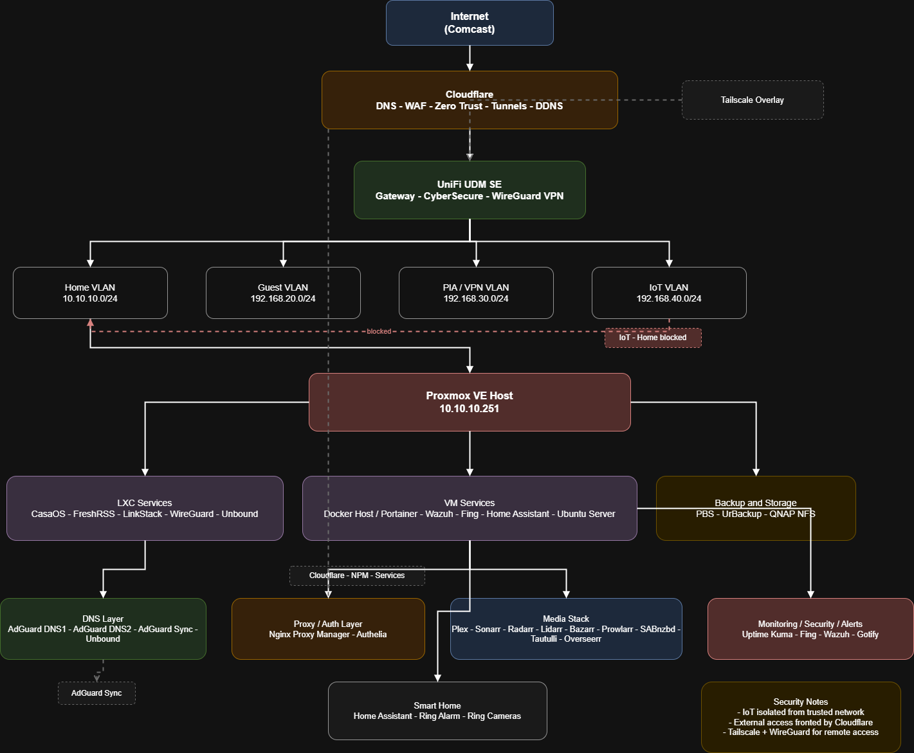

# 🏠 Home Lab Architecture

This repository documents the architecture, networking, and security design of my home lab environment.

---

## 🏗 Architecture Overview

This lab is built around:

* Proxmox virtualization
* VLAN segmentation (Home, Guest, IoT, VPN)
* Cloudflare Zero Trust + tunnels
* UniFi network infrastructure
* Docker + self-hosted services
* Centralized monitoring and security tools

## 📊 Architecture Diagram



### 🔎 Overview

This diagram represents a segmented home lab environment with:

- External access secured via Cloudflare Zero Trust
- Internal segmentation across multiple VLANs
- Centralized compute using Proxmox
- Containerized services and monitoring stack

---

## 📊 Diagram

*(Will be added below)*

---

## 🔐 Key Design Goals

* Segmented and secure network design
* Remote access without exposing services directly
* Scalable and modular infrastructure
* Real-world enterprise-style architecture

---

## ⚙️ Core Stack

* Proxmox VE
* UniFi UDM-SE
* Cloudflare (DNS, WAF, Zero Trust)
* Docker / Portainer
* Nginx Proxy Manager
* Wazuh / Uptime Kuma
* AdGuard + Unbound

---

## 📂 Structure (WIP)

```
docs/
  diagrams/
  architecture.md
  network.md
```

## 📂 Documentation

- [Architecture](docs/architecture.md)
